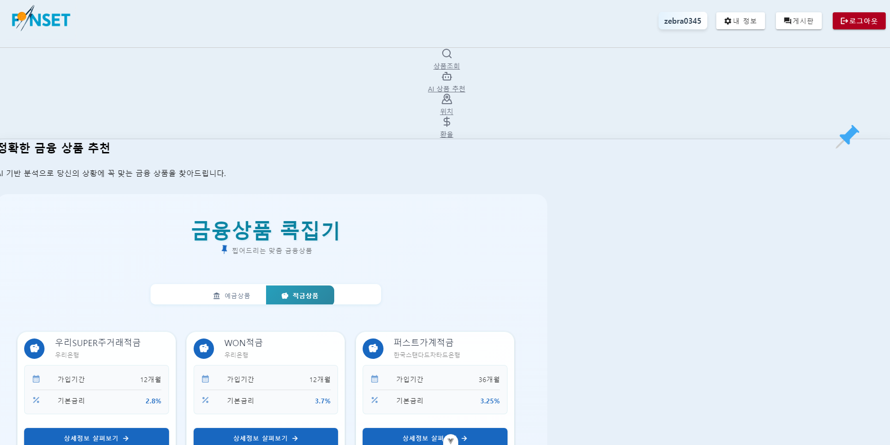
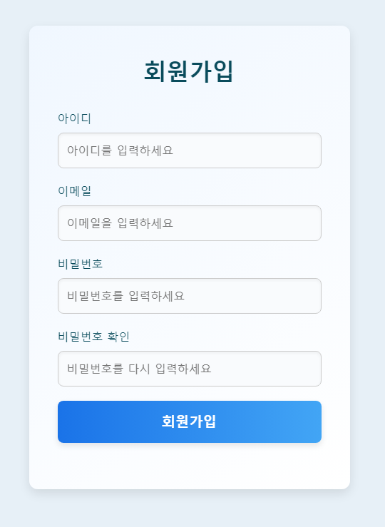
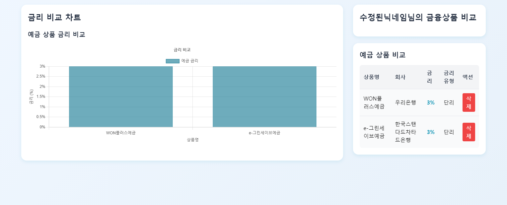
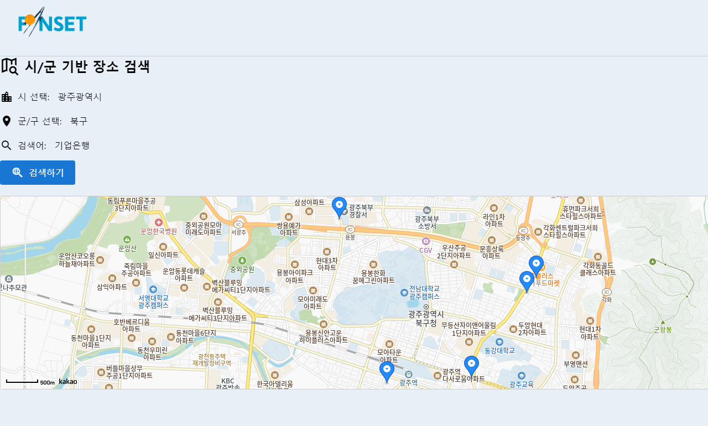
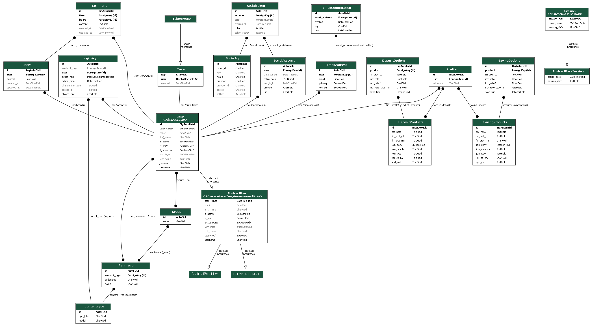
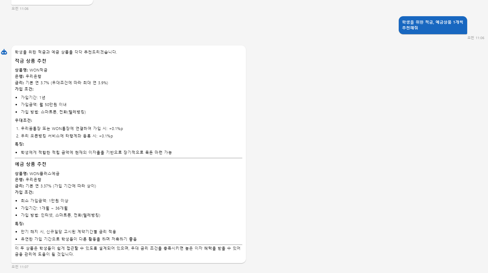

<h1 align="center">
  🌟FinSet - 당신을 위한 금융상품 추천 서비스🌟
</h1>

<p align="center">
  <i>당신에게 딱 맞는 금융상품을 추천해주는 서비스 🚀</i>
</p>

---

## 📌 팀 소개

| **이름**   | **업무 분담**          |
|------------|------------------------|
| 신우진     | 팀장, 백엔드           |
| 김동해     | 팀원, 프론트엔드       |

### 🛠️ 신우진
- **django**로 백엔드 환경 구축
- 회원 로직 및 게시판 백엔드 구현
- 데이터베이스 ERD 설계 및 API 데이터 연동
- 챗봇 기능 구현

### 🎨 김동해
- **vue.js**로 프런트엔드 환경 구축
- 메인 페이지 및 회원 로직 디자인
- 비동기 통신을 활용한 게시판 구현
- 금융상품 검색 및 장바구니 기능 개발

---

## 📖 서비스 소개

`FinSet`은 금융상품 정보를 확인하고, 개인 상황에 맞는 금융상품을 추천받을 수 있는 서비스입니다.
- **챗봇**으로 손쉽게 금융상품 추천받기
- **장바구니**에 관심 있는 금융상품 담기
- **내 정보 확인**으로 담은 상품을 차트로 비교

### 서비스 주요 화면

#### 📌 메인 화면


- 상단에서 내 정보 확인 가능
- NAVBAR로 주요 기능으로 이동

#### 📌 회원가입과 로그인


- 이메일 유효성 검사 및 아이디 중복 확인

#### 📌 내 정보 확인


- 내가 담은 상품을 차트로 비교

#### 📌 주변 은행 검색


- **카카오맵 API**를 기반으로 시·군·구 검색

---

## 📊 데이터베이스 ERD

<table align="center">
<tr>
  <td></td>
</tr>
</table>

### 주요 테이블 설명

- **Account**
  - `User`: Django 기본 모델 상속
  - `Profile`: 사용자 프로필 (닉네임, 저장 상품 연결)

- **Boards**
  - `Board`: 게시판 데이터 관리
  - `Comment`: 댓글 데이터 관리

- **finSetApp**
  - `DepositProducts`: 예금 상품 데이터
  - `SavingProducts`: 적금 상품 데이터
  - **Options 테이블**: 예금/적금의 세부 옵션 관리

---

## 🛠️ 기술 스택 및 서비스 흐름도

### 사용 기술 스택
<div>
  
  
  
  
  
  
</div>

### 서비스 흐름도


---

## 🤖 추천 알고리즘 (챗봇)



- **생성형 AI 기반** 챗봇으로 예금·적금 상품 추천
- 프롬프트 엔지니어링 활용:
  ```text
  ## 페르소나 : 당신은 금융상품 및 API에 대한 전문 지식을 보유한 전문가입니다.
  ## 역할 : 사용자의 요구를 기반으로 금융상품 추천
  ## 제약사항 : 제공된 데이터를 분석하여 최적의 상품 추천
  ```

## 최종 소감
- 신우진
  - 백엔드에 대해 고민을 더 깊게 하고, 이해를 잘 할 수 있는 기회였습니다.
  - 각종 API에 대한 호출을 해보고 공식문서를 읽어보며 발전할 수 있는 좋은 기회였습니다.
  - 좋은 팀원과 함께 할 수 있어서 긍정적인 기억으로 남을 것 같은 프로젝트였습니다.
- 김동해
  - 이번 학기 말에 진행된 관통 프로젝트에서 프론트엔드 개발을 전담하게 되면서 학기 중 배웠던 vue의 활용과 django와의 연동의 부분에서 개인적으로 부족함을 많이 느꼈습니다. 
  - 그리고 저희 서비스의 첫인상을 담당하는 디자인과 컨셉을 보다 새롭고 창의적인 아이디어를 통해 매력적인 서비스를 만들어보고자 노력했지만, 기대만큼 잘 이루어진 것 같지는 않아 아쉬움이 남습니다.
  - 그럼에도 불구하고 훌륭한 페어를 만나게 되어 전반적인 설계와 구현 과정에서 큰 어려움 없이 프로젝트를 완수할 수 있었습니다. 
  - 이번 경험을 통해 부족한 점을 보완하고 더 나은 개발자로 성장할 수 있는 계기가 되었던 것 같습니다.